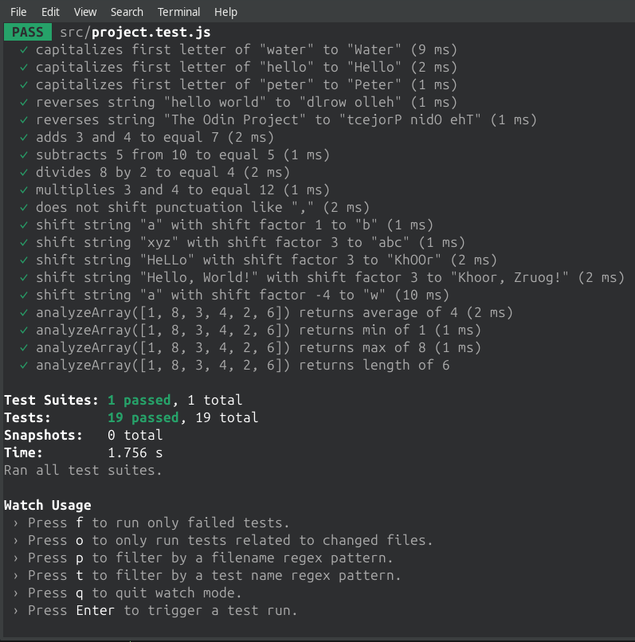

# Project: Testing Practice

The Odin Project: JavaScript Course

## ℹ️ Description

It's the first project that introduces Test Driven Development using Jest. It includes very basic examples.

## ✅ Features

- Capitalize and reverse strings
- Basic Calculator with methods for add , subtract, multiply, divide
- Caesar Cipher with postive and negative shifting
- Array analyzer for average, min, max, and length

## ⚙️ Tech Stack

  
  
  
  

## 📸 Screenshots

<figure>
  
  <figcaption>Terminal Output</figcaption>
</figure>
